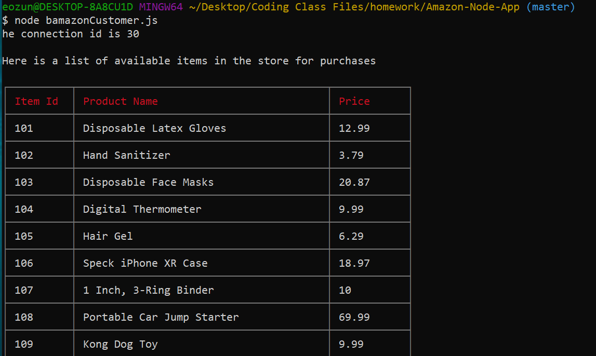
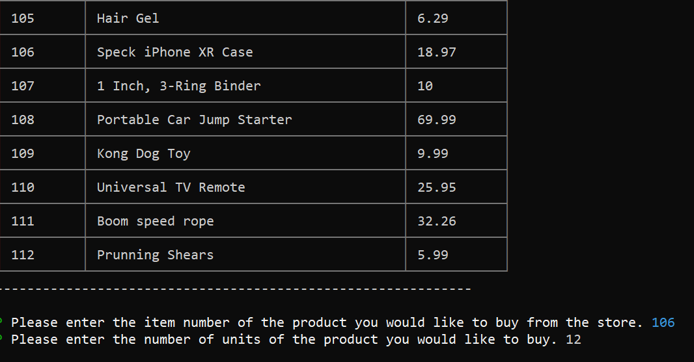
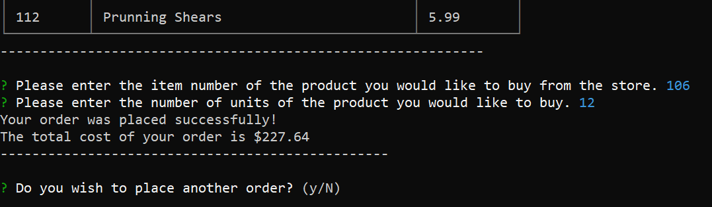
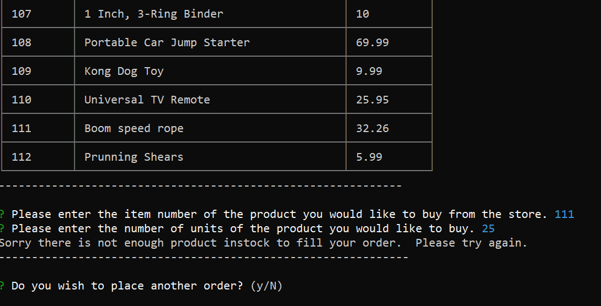

# Amazon-Node-App (First mySQL application)

### Overview
This application is a CLI node application that at as a node version of the Amazon store.  The application functions as CLI based amazon store.  The application will allow a customer to access the stores database, see the list of products available in the store database for purchase, and purchase the products.  The application will then update the store database based on the customers order.  The application also allows the manager of the store to access the stores product database.  The manager will be able to also see a complete list of products and stock available in the stores database.  The application will allow the manager to select to see only a list of items with low stock, it will allow the manager to increase the amount of stock for each item in the database, and it will also allow the manager to add a new item with stock quantities to the database. I was the sole creator of this application.

### How the application is organized
This application uses 2 seperate javascript files: bamazonCustomer.js, bamazonManager.js.  The Customer.js file is used to allow a customer to interact with the store and it database to order products.  The Manager.js file is used to allow managers to access the store and its database so they can keep track and manage the contents of the store.  Finally the stores product database was create and stored in a localhost mySQL database under the name *bamazon*.  The list of products is stored in a table in the *bamazon* database under the name *products*.

The first part of both the Manager.js file and Customer.js file involves requiring access to all of the previously installed modules for use in the application.  Next, both files create a connection to the *bamazon* database that will allow each user to retrieve product information from the stores database and also manipulate the information in the database as well.

The Customer.js file then will call a function called *displayAvailableItems* that displays a list of available items to the CLI.  It displays the id number for each item, the name of the item and the price of each item.  The next function, *placeOrder*, will allow the customer user to purchase a certain number of product items from the list of previously displayed items.  The *confirmQuantity* function, checks to make sure that there is enough stock of the item selected by the user to purchase.  If not enough stock is available with will notify the customer via the CLI that there is not enough stock.  If the customer chooses a product item that is not in the database it will also notify the customer via the CLI that they no item was available for the item id they entered.  If enough stock is available for the selected product id, then the *confirmQuantity* will call the *updateStock* function which will update the stock quantity for the selected product in the database.  It will adjust the stock quantity based on the amount ordered by the customer and display the total cost of the purchase to CLI for the customer.  Finally, the file has a *startAgain* function that will ask the customer if they want to purchase more items from the store or not again using the inquirer module.  If the customer selects yes, then the *displayAvailableItems* function will be called again and the above process will start over, otherwise, the application ends and the connection to the database is closed.

The Manager.js file will call a function called *start* that users the inquirer module to display a list of options to perform for the manager.  The next function called *listProducts* displays a full list of products in the stores database to the CLI.  The next function, *lowInventory*, is called which displays to the CLI a table containing the all the information on products whose stock quantity is less than 5.  The *addToInventory* function, will prompt the manager to select a product item to add additional stock to, and asks how much stock will be added.  It then updates the stock quantity in the database if it can find the product item number.  The *addNewProduct" function will allow the manager to add a completely new product to the database, and will prompt the manager to enter in all the necessary information for the new product.  The final function of this file called *startAgain* will ask the manager if they wished to perform more actions on the products or leave the application.

### Technologies used in the application
1.  Javascript
2.  Node.js
3.  mySQL server
4.  Inquirer NPM
5.  Cli-Table NPM

## Instructions for use of the application
### Before using the app
Before you can start to use the app you will need to install the following modules.  To install each of the modules, type in the code below on the command line for each module replacing "module name" with the actual name of the module.

`$ npm install <Module Name>`

Here is a link to the documentation for inquirer to use as a reference 
* [inquirer](https://www.npmjs.com/package/inquirer)
* [mySQL](https://www.npmjs.com/package/mysql)
* [cli-table](https://www.npmjs.com/package/cli-table)

### Running the application
To start the application you will need to type in one of the following lines of code into the command line terminal based on whether you would like to be a customer or manager.

`$ node bamazonCustomer.js` or `$ node bamazonManager.js`

#### Customer applicaton
The application outputs to the CLI a list of available product items to purchase and then prompts the user which item to select to purchase and asks how many items they want to purchase. Below is a screen shot of this 

  
  

Once the customer enters in the appropriate information the application will notify them that the order was successful placed and display to the CLI the total cost of their order.  It will then ask the customer if they want to place another order or not.

  

Once the user has correctly guessed the name of the character before they run out of guesses then the application outputs that the user won and asks if the user wishes to play the game again.  Below is a screen shot of this example.

If the customer places an order for more products that the current stock quantity in the store the purchase will not proceed and the customer is alerted via CLI about the failed order.

If the user enters "yes" or "y", then the application will restart and the list of products available is re-displayed.  Otherwise, if the user types in "no", "n", or justs hit enter the application will end and the application will stop.  If you wish to play other game after the application stops you will have to re-enter the CLI code above to restart the application.

  

If the user enters "yes" or "y", then the game will restart and a new character name will be choosen.  Otherwise, if the user types in "no", "n", or justs hit enter the game will end and the application will stop.  If you wish to play other game after the application stops you will have to re-enter the CLI code above to restart the application.

If the player runs out of guesses before they correctly complete the name, then the application outputs that the user lost, and asks if the user wishes to play the game again.  If the user enters "yes" or "y", then the game will restart and a new character name will be choosen.  Otherwise, if the user types in "no", "n", or justs hit enter the game will end and the application will stop.  If you wish to play other game after the application stops you will have to re-enter the CLI code above to restart the application.  Below is a screen shot of this example.

## Links associated with the application
1.  Link to git hub repository for this app:  [Github Link](https://github.com/eozuna3/Constructor-Word-Guess)
2. Here is a links to videos showing how the application functions: [Constructor-Word-Guess-Game](https://drive.google.com/file/d/1hbL28NIDCxZHkX-bcyZsvZi0PUa5oiIH/view?usp=sharing)
